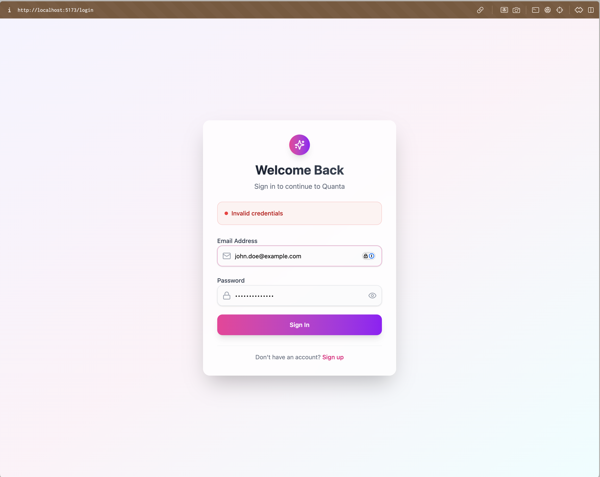
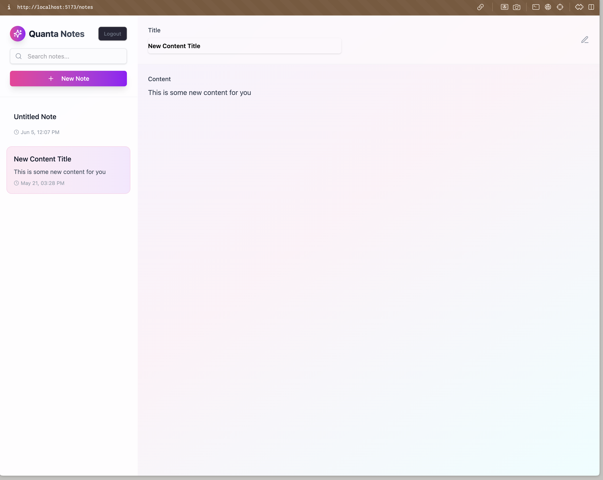

# 📝 Collaborative Notes App (Go + Fiber)

A real-time collaborative note-taking application built with **Go**, designed to help users create, edit, and share notes in a seamless and interactive environment.

## 📸 Screenshots

